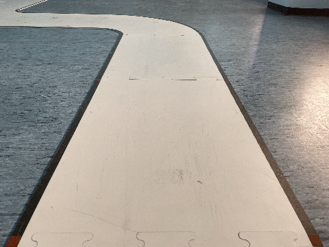
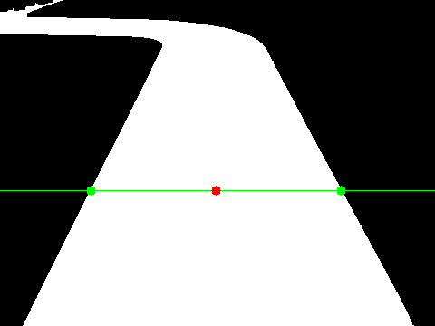

# Usage

`imaging` does not take any input and continuously outputs a `path` stream. It contains a preprocessed image, which is (typically) later used by the `controller` service to make a decision on where to go.

## Format

Output sent to the `path` stream has the following formatting (see example below) and is being sent as **raw bytes**.

```
output := pb_output.SensorOutput{
			SensorId:  25,
			Timestamp: uint64(time.Now().UnixMilli()),
			SensorOutput: &pb_output.SensorOutput_CameraOutput{
				CameraOutput: &pb_output.CameraSensorOutput{
					DebugFrame: &pb_output.CameraSensorOutput_DebugFrame{
						Jpeg:   imgBytes.GetBytes(),
						Canvas: &canvas,
					},
					Trajectory: &pb_output.CameraSensorOutput_Trajectory{
						Points: trajectory_points,
						Width:  uint32(imgWidth),
						Height: uint32(imgHeight),
					},
				},
			},
		}
```
`SensorOutput_CameraOutput` object contains a `CameraSensorOutput` object with 2 main fields:
1. `CameraSensorOutput_DebugFrame` containing:
    -  `Jpeg`, a (prerpocessed) acquired frame transmitted as a raw byte array of a JPEG image and the 
    - `canvas`, contains a `width` and `height` fields, as well as an array of `CanvasObject`s, which are either a `Line`, `Rectangle` or `Circle`. It can be used for example to overlay these shapes on top of the JPEG image. 

2. `CameraSensorOutput_Trajecotry` is composed of:
    - `trajectory_points` array of points obtained by processing the image (more below)
    - `Width` of the acquired image. 
    - `Height` of the acquired image

## Trajectory points

Each frame captured by the camera is first preprocessed to identify the boundaries of the track. Afterwards, an imaginary horizontal line is drawn through the image and boundaries of the track are highlighted. Next, the point centrally between them is found. It is then passed to the output stream as an **array containing 1 element**, which makes it easier to later modify imaging to adopt a more advanced processing algorithm. Visual representation of what the algorithm does is given below:

initial image            |  after highlighting the points
:-------------------------:|:-------------------------:
  |  

## Further reading

An example of decoding `path` stream message and using the fields separately can be found in the `controller` service.

More information about `canvas` and `trajectory_points` can be found here: https://github.com/VU-ASE/rovercom/blob/main/definitions/outputs/camera.proto